# Introduction

## Description

The goal of this project was to create a simulation of the Distributed
Coordination Function (DCF) of 802.11 for the purpose of analyzing performance
characteristics. Specifically, we were looking for data explaining the
throughput, fairness, and collision-propensity of different network topologies
both with and without virtual carrier sensing.

## Responsibilities

For this project, we shared responsibility for coding and documentation. We met
once to kick-off the project and discussed our approach to solving the problem.
After that, we used git to collaborate on code and kept in contact via text
message.

Timothy took responsibility for Poisson traffic generation, instantiating the
simulation controller and sending arriving packets to the model. He also used
Matlab to generate graphs of our simulated data.

Joshua took responsibility for coding the models of the simulation by
implementing state machines to follow the specified protocols.

# Simulation Methodology

## Source code
The source code for our simulation is available on GitHub:

+ [https://github.com/jbree/CollisionSimulator](https://github.com/jbree/CollisionSimulator)

## Simulation Components

To simulate the DCF, we created an object-oriented model using C++. We decided
to separately model the sending and receiving stations, and also the
medium/channel which packets are sent through. We then used a simulation
controller to orchestrate the simulation.

The simulation is advanced using a tick-tock sequence. Tick and tock, in our
simulation, loosely represent slot beginning and end, respectively.

Our simulation's data rates, collision domains, and sender-receiver graph are
configurable via input file. The input file describes which stations belong to
which medium, which sender stations transmit to which receivers, and at what
rate.

### DataGenerator

The _DataGenerator_ class in our simulation generates a list of arrival times
using a Poisson distribution, and quantizes those arrivals into slots. The
arrival time generator accepts a specified rate ($\lambda$) to use in the
calculations. We used the `random()` function from the Standard C Library to
generate uniformly distributed numbers, with a seed provided by the current time
value.

### SimulationController

The _SimulationController_ configures each of the simulated components based on
an input file. After configuring each of the models, the _SimulationController_
advances the simulation timeline by invoking the `tick()` and `tock()` methods
on the individual modeled components. Using the lists of generated arrival
times, the _SimulationController_ invokes the `arrive()` method on a
_SenderStation_ to indicate that a packet is ready.

At the end of the simulation, the _SimulationController_ is responsible for
collecting and printing information about successful transmissions and
collisions, which is gathered from the modeled components.

### SenderStation

The _SimulationController_ gives packets to the _SenderStation_ via the
`arrive()` method, which causes a packet to be enqueued for transmission. Once a
packet has arrived, the _SenderStation_ uses a state machine to coordinate its
sense, backoff, transmission, and wait-for-ACK periods.

When the _SenderStation_ has completed its sense and backoff periods, it sends
the packet to a _Medium_ via the _Medium_'s `transmit()` method.

### Medium

It is useful to model the transmission medium to have an easy way for stations
to determine if the medium is busy. All packets must arrive between invocations
of `tick()` and `tock()`. A sender may then check with a _Medium_ after a tock
to see if it was busy in the most recently ended slot.

### ReceiverStation

Each _ReceiverStation_ waits for packets to be received from every _Medium_ it
listens and transmits on, and responds accordingly. If multiple messages are
received during a single slot, whether from a single or multiple media, the
_ReceiverStation_ will observe a collision ignore the inbound packets.
<!--
# Graphs of Results

## Throughput per Node

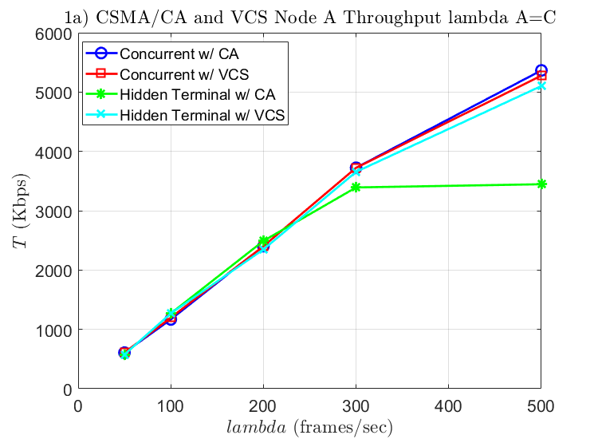

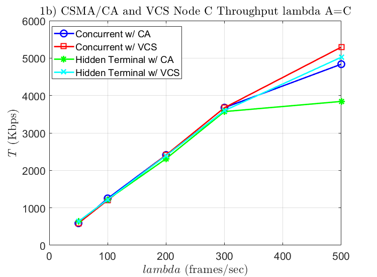

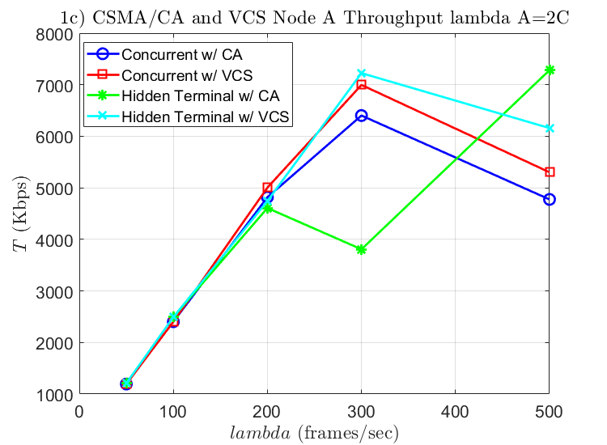

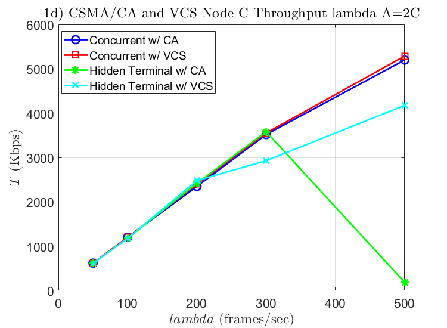

## Overall Throughput

In addition to the requested graphs, we felt it would be useful to provide
graphs of the combined throughput from both nodes.

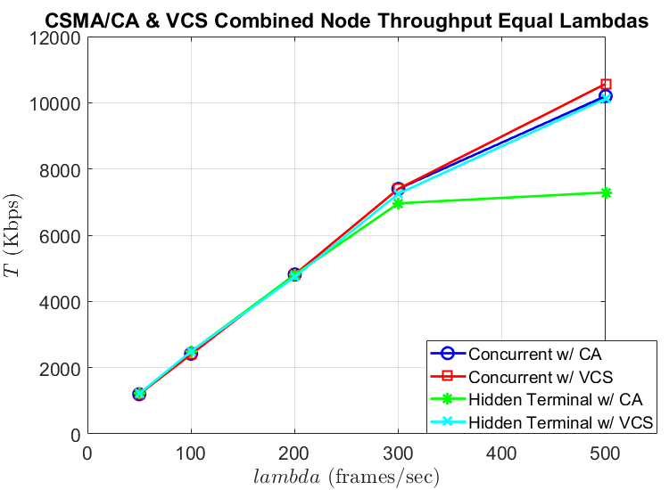
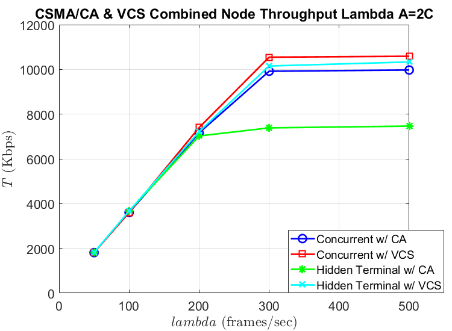

## Collisions

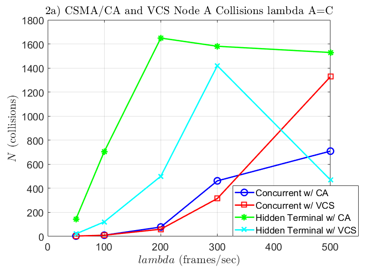
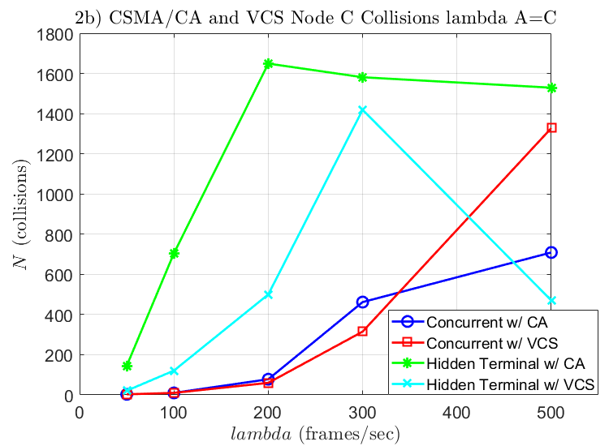

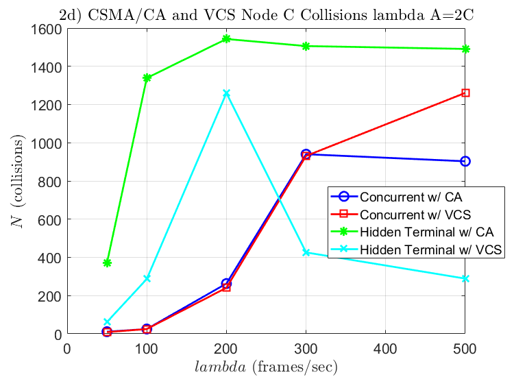

## Fairness

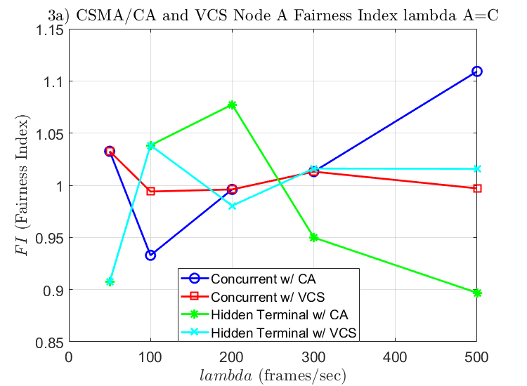
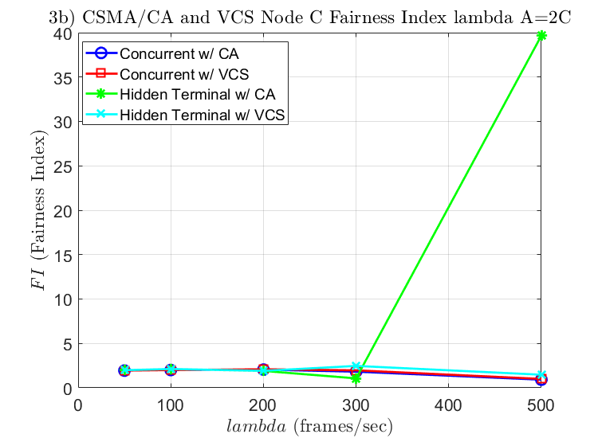
-->
# Justification

## Throughput in _Topology a_

We expect a maximum throughput of 12Mbps. The total number of theoretical
packets (discounting sensing, backoff, and ACK time) is given by the following
equation:

$$ \frac{12\text{MB}}{\text{sec}} \times \frac{1 \text{ frame}}{1500\text{B}}
\times \frac{1\text{B}}{8\text{b}} = 1000 \text{ frames per second (fps)} $$
 
Knowing this, we can conclude that two stations with combined packet arrivals
greater than or equal to 1000fps will necessarily become backlogged.

Thus, for the simulations operating with equal lambda values up to 500fps such
as the ones shown in graphs 1a and 1c, the trend is that throughput continues to
increase as lambda is increased. In the cases where node $A$'s lambda value is
twice of node $B$’s, the average arrival rate between nodes can exceed 500fps.
As a result, there is an observable impact on the throughput. Viewing the graph
displaying the combined throughput of simulations where node $A$'s lambda value
is twice node $B$'s, the graph plateaus after 300fps. This demonstrates that for
the values observed within the simulation, communication becomes fully congested
somewhere after an arrival rate of 600fps for node $A$ and 300fps for node $B$.

This observed throughput ceiling matches our expectations. The observed
throughput _must_ be less than the theoretical limit, since the observed limit
encounters collisions and overhead, whereas the described theoretical limit does
not.

## Throughput in _Topology b_
 
_Topology b_ is where we see a big difference in throughput depending on whether
VCS is enabled. With VCS disabled, the throughput ceiling appears to be at
~7.3Mbps. With VCS enabled, throughput appears to be at ~10Mbps. One of the
surprising things about enabling VCS was how small the performance penalty is to
handle the hidden terminal case.
 
Without VCS, we expected throughput to be much lower with a hidden terminal.
Exponential backoff is surprisingly effective at maintaining throughput (albeit
at a reduced rate), though that comes at the price of reduced fairness (as
discussed later).

## Hidden Terminals and Fairness

It appears that when virtual carrier sensing is not enabled, channel usage is
very unfair. When stations $A$ and $C$ first try to transmit, they both
experience collisions until their $CW_0$ becomes large. Eventually, one of the
stations is successful. When this station, $A$, is successful, its $CW_0$ is
reset, and it is likely to have additional successes while $C$ continues to wait
with its large backoff time. Even when additional collisions occur between the
two, $A$ is more likely to find eventual success, since a few collisions
resulting in $CW_0 = 32$ or $CW_0 = 64$ have a trivial impact compared to $C$’s
$CW_0 = 1024$.
 
Comparing graphs 1c and 1d, the green line representing throughput for the
hidden terminal, sans-VCS case when $\lambda_A = 2\lambda_C$ shows that, once
the channel becomes saturated, node $A$ and node $C$ no longer transmit in a
ratio matching their relative $\lambda$. In our simulation runs, node $C$ had a
throughput rate of ~3400kbps with an arrival rate of 300fps. Node $A$, at an
arrival rate of 600fps, has throughput of ~3800kbps. The fact that the node $A$
at 600fps is not operating at twice the throughput rate of $C$ at 300fps
indicates that, at these frame rates, the channel has reached saturation.
 
Interestingly, we observe that at the 600fps/300fps arrival rates with hidden
terminals, the fairness index remained close to 1. Given our expectation of
significant unfairness depending on random backoff values, we are unsure if we
can draw a conclusion from this value, or if it is an anomaly requiring further
simulation.
 
Once we simulated the $\lambda_A = 2\lambda_C$ scenario with VCS enabled, we saw
that the fairness index was ~2 when the channel was below saturation. As the
arrival frame rate surpassed the channel saturation point, the fairness index
dropped to ~1. Since, below saturation, the arrival framerate from $A$ is twice
that of $C$, we expect that the throughput rate would also be double. However,
as the channel is saturated, $A$’s throughput becomes bounded by the channel,
and both $A$ and $C$ are restricted to approximately the same throughput rate.
